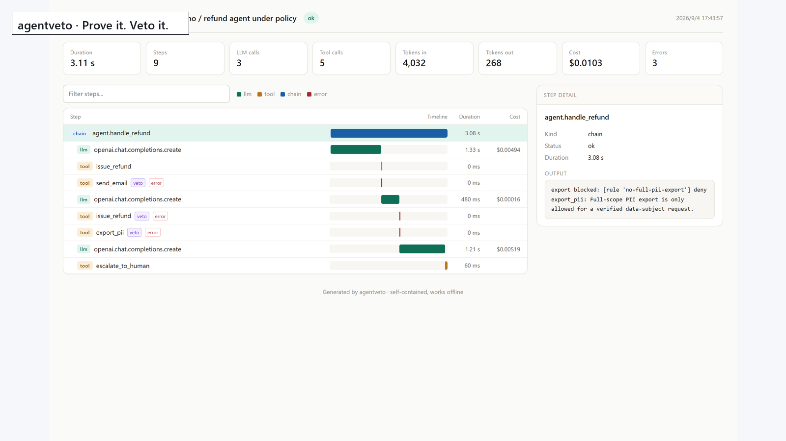
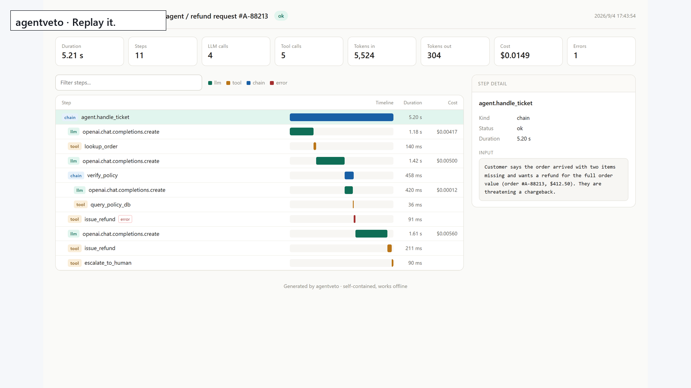

# agentveto

**Replay it. Prove it. Veto it.**

Every other tool answers "what did my agent do?". Those tools already exist,
and there are a lot of them. `agentveto` is being built for the harder
question: **what is my agent allowed to do, and can I prove it afterwards?**

Today it does the first part properly. It records every step - prompts, tool
calls, tokens, cost, timing, errors - into a local SQLite file and turns it
into a single HTML file you can open, search, and attach to an incident
report. Then it replays the whole run for free.

No account. No SaaS. No network call. Everything stays on your machine.

```bash
pip install agentveto
```

## 60 seconds

```python
import agentveto

agentveto.init()  # wraps any installed openai / anthropic SDK


@agentveto.trace(kind="tool")
def lookup_order(order_id: str) -> dict:
    return db.orders.find(order_id)


@agentveto.trace
def handle_ticket(ticket: str):
    order = lookup_order(parse_id(ticket))
    return decide(order)


handle_ticket("two of three items never arrived")

agentveto.report()  # writes agentveto-handle-ticket.html
```

Open the HTML file. Every step is on a timeline, clickable, with its input,
output, token count and cost.

**No API key and no LLM?** Run the built-in example:

```bash
python examples/demo.py
```

## What the report looks like



Three calls in this run were refused *before* they executed. The denied rows are
red, the ones that went through a human prompt (and failed closed, since no
human was attached) carry the same `veto` tag. Click any row for the exact
prompt, response, model and cost.

The replay-only view is the same shape, minus the veto tags:



Regenerate these from the bundled demos with:

```bash
python scripts/make_assets.py
```

## What it does today

| | |
|---|---|
| **Zero setup** | `init()` and you are done. No project, no token, no dashboard to sign into. |
| **Auto-instrumentation** | Installed `openai` or `anthropic` SDKs are wrapped automatically - tokens and cost captured without touching your call sites. |
| **Explicit spans** | `@trace` or `with start_span(...)` for your own functions and tool calls. Nesting is automatic. |
| **Cost attribution** | Per-step and per-run, using a pricing table you can override. Unknown models are reported as unknown rather than guessed. |
| **Record and replay** | First run records LLM responses. `init(replay=True)` replays them, so a 40-step run is reproducible for free. |
| **Policy gates** | `@guard` evaluates a call *before* it runs and can deny it or route it to a human. Blocked calls are on the record like everything else. |
| **Tamper-evident evidence** | `prove sign` chains every run's digest and optionally signs it with Ed25519. `verify` detects a single changed byte and names the run it is in. |
| **Self-contained reports** | One HTML file, no CDN, no build step. Renders offline, six months from now, on a plane. |
| **Nothing leaves your machine** | Traces are written to `./agentveto.db`. There is no server component. |

## Veto: stop a call before it runs

Replay tells you what happened. `@guard` decides, before a dangerous call goes
out, whether it is allowed to happen at all:

```python
from agentveto import guard, VetoError

POLICY = {
    "default": "allow",
    "rules": [
        {
            "name": "no-customer-email",
            "action": "send_email",
            "effect": "deny",
            "reason": "Outbound customer email requires a human in the loop.",
        },
        {
            "name": "refund-needs-approval",
            "action": "issue_refund",
            "effect": "ask",
            "when": {"amount_usd": {"gt": 250}},
            "reason": "Refunds over $250 need a human approver.",
        },
    ],
}


@guard(POLICY, action="send_email")
def send_email(to, subject, body): ...


@guard(POLICY, action="issue_refund")
def issue_refund(order_id, amount_usd): ...


issue_refund("A-1", 214.50)  # under the line: runs
issue_refund("A-1", 412.50)  # raises VetoError - no money moves
```

- **deny** raises `VetoError`; the wrapped function never executes.
- **ask** prompts on the terminal and **fails closed** (denies) where there is
  no human - CI, a cron job, a server.
- Policies are plain dicts: ordered rules, first match wins, `when` clauses
  with `eq/ne/gt/gte/lt/lte/in/exists` on dot paths into the call payload.
- Every decision is written onto the trace, so a blocked call appears in the
  same HTML report as the steps around it, marked `veto`.

```bash
python examples/veto_demo.py     # 3 blocked calls, no API key needed
```

## Replay: the part that matters

```python
agentveto.init()  # run once: records every LLM response
agentveto.init(replay=True)  # run again: serves recorded responses
```

The LLM calls come from disk; everything else - routing, tool calls, branching,
your business logic - executes for real. That is what makes an old run
reproducible instead of merely inspectable. It also makes iteration on step 37
free, because you stop paying for steps 1-36.

Streaming responses are traced but not replayable yet.

## Prove: evidence you can hand to an auditor

A trace in a SQLite file is only as trustworthy as whoever controls the file.
`prove` turns a run into evidence: a canonical digest chained across runs,
optionally signed with Ed25519, exportable as one portable file that anyone can
verify offline - without your database and without your secret key.

```bash
agentveto prove keygen -o ./keys                            # agentveto.key + agentveto.pub
agentveto prove sign --db agentveto.db --key ./keys/agentveto.key
agentveto prove export --db agentveto.db --run <run-id> -o incident.evd

agentveto verify incident.evd       # the auditor's path: offline, no db needed
agentveto verify agentveto.db       # or: is my own store still untouched?
```

```
OK      ok
  [ok] target_run_digest   data matches attested digest
  [ok] chain               ok
  [ok] head_anchor         ok
  [ok] signature           valid
```

Two layers, on purpose:

- **Integrity** (zero dependencies, always on): every run gets a SHA-256 digest
  of its stored rows, and runs are linked into a hash chain from a genesis
  value. Change one byte in one span and verification fails, naming the run.
- **Authenticity** (optional, `pip install 'agentveto[sign]'`): an Ed25519 key
  signs the chain head, so a third party can verify the whole history without
  holding your key.

Signing is a deliberate act, not ambient tracing - you sign when you want to
lock in the record. That keeps recording fast and dependency-free.

**Honest limits:** this proves the integrity of what was recorded, not that the
recording is true. Anyone who edits the database *before* you sign edits the
evidence too, so sign at the moment that matters. The chain is linear rather
than a Merkle tree: the right size for one process's history.

## How this compares

Recording is a crowded space. Here is the honest map:

| | agentveto | agentblackbox | agentledger (TS) | LangSmith | LangFuse |
|---|---|---|---|---|---|
| Python-native | yes | yes | no | yes | yes |
| Works fully offline | yes | yes | yes | no | no |
| Account required to view a trace | no | no | no | yes | no |
| Single-file report you can email | yes | no | no | no | no |
| Deterministic replay of LLM calls | yes | yes | no | no | no |
| Runtime policy enforcement | yes (V1 preview) | no | no | no | no |
| Tamper-evident evidence chain | yes (v2 preview) | no | yes | no | no |
| Signed, portable evidence file | yes (`.evd`) | no | no | no | no |

Nobody in the Python ecosystem does enforcement yet. Recording tells you what
went wrong; a veto point stops it from going wrong. The preview of that is in
this repo now.

The other honest part: today this does less than the hosted platforms. No
prompt management, no dataset curation, no hosted dashboards. It does one thing
- tell you exactly what your agent did - with no setup and no data leaving your
machine.

## Roadmap

1. **Replay** (done) - deterministic reproduction of any run, locally, for free.
2. **Veto** (done, preview) - a policy gate that evaluates a step *before* it
   executes and can block it or route it to a human. The part nobody else has.
3. **Prove** (done, preview) - hash-chained, optionally signed traces so a run
   can be handed to an auditor as evidence, not as a screenshot.
4. **Responsibility credentials** (next) - bind an attested run to who authorised
   the agent, so "the agent did it" has a named human behind it.

## CLI

```bash
agentveto demo                 # example run, no API key needed
agentveto demo --veto          # policy-gate demo: calls blocked before they run
agentveto list                 # recorded runs
agentveto report --run <id>    # write a report for a specific run
agentveto serve                # local viewer (pip install 'agentveto[serve]')

# policy tooling
agentveto policy show policy.json
agentveto policy validate policy.json --strict
agentveto policy explain policy.json --action send_email --payload '{"to":"x@y.com"}'

# evidence (pip install 'agentveto[sign]' to enable Ed25519 signing)
agentveto prove keygen -o ./keys
agentveto prove sign --db agentveto.db --key ./keys/agentveto.key
agentveto prove export --db agentveto.db --run <run-id> -o incident.evd
agentveto verify incident.evd
agentveto verify agentveto.db
```

## MCP server (Claude Code, Cursor, ...)

```bash
pip install 'agentveto[mcp]'
```

Then add to your editor's MCP config:

```json
{
  "mcpServers": {
    "agentveto": {
      "command": "agentveto-mcp",
      "args": ["--policy", "/abs/path/to/policy.json"]
    }
  }
}
```

The LLM in your editor can now ask `evaluate_policy("send_email", {...})`
and rewrite a call before it gets vetoed at runtime. Full docs:
[`docs/mcp.md`](docs/mcp.md).

## Configuration

```python
agentveto.init(
    db="./traces.db",  # or set AGENTVETO_DB
    replay=False,  # serve recorded responses instead of calling the API
    record=True,  # store responses for later replay
    auto_patch=True,  # wrap installed LLM SDKs
)

agentveto.set_pricing({"my-internal-model": (1.0, 4.0)})  # USD per 1M tokens
```

## Status

Early. The data model and the report are stable enough to rely on; the API may
still change before 1.0. Issues and PRs welcome.

## License

Apache 2.0
